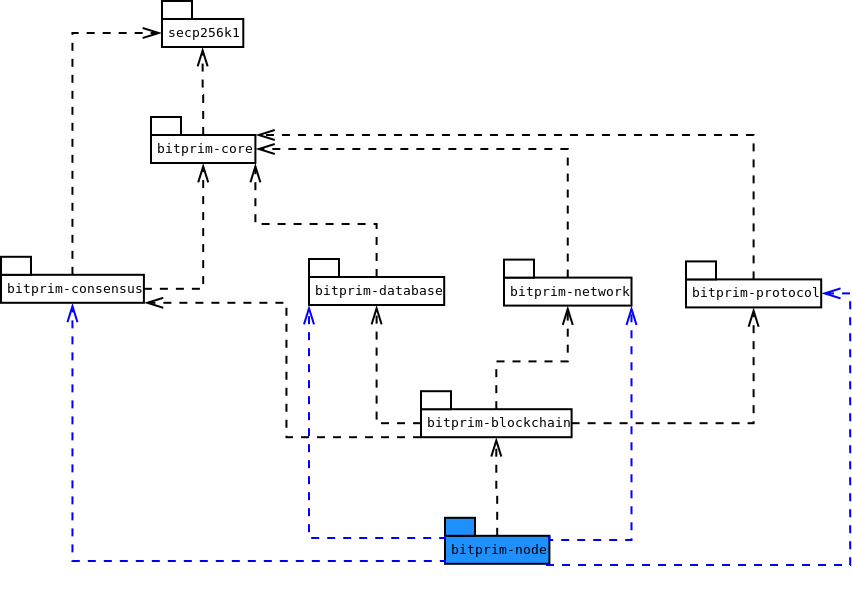
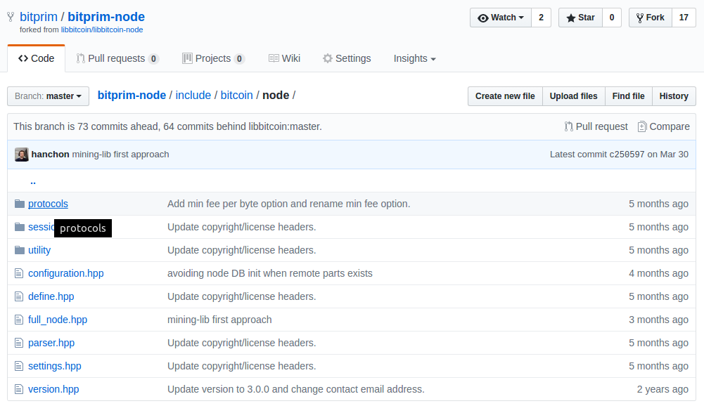
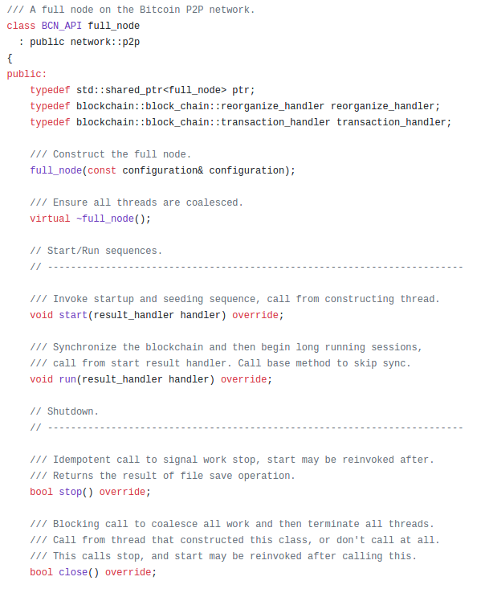

Bitprim's C++ interface is the base layer of the platform, the lowest abstraction level available. It's a fork of the Satoshi/reference implementation with several improvements, the main of them being modularization. Being monolithic, the reference client is harder to change, not only because a change ripples across the whole system, but also because it's not possible to mix and match different module implementations.

## Package diagram

---

If we were to view the Bitprim projects as UML packages, their dependencies would look like this \(some projects omitted for simplicity\):

## Which is the main responsibility/functionality for each package?

---

* **secp256k1**: Implementation of the standard of the same name which deals with ellyptic curves cryptography.
* **bitprim-core**: Basic Bitcoin utilities \(encryption, wallet, math\)  to be reused by all projects.
* **bitprim-consensus**: An implementation of Satoshi's algorithm for agreeing on a course of action \(achieving consensus\) between nodes in a network.
* **bitprim-database**: Defines how to store and manipulate Bitcoin transactions.
* **bitprim-network**: P2P communication rules between nodes in the Bitcoin network.
* **bitprim-protocol**: Defines payload structure and lower level communication details.
* **bitprim-blockchain**: Interface for accessing the Bitcoin public ledger, a.k.a. blockchain, in which all transactions are linked between them.
* **bitprim-node**: The highest level of abstraction: a full node in the Bitcoin network; it can query the blockchain in many ways and insert blocks as well.

## Exploring the public interface for each package

---

All packages follow the same structure: At the top level of their source tree, they have an **include** directory. Inside it, there's a single .hpp file which \#includes all the public headers for the package for convenience. Then, inside the include directory, all the public headers for the library reside. These represent the public interface, i.e. those classes meant to be consumed by other packages or programs built on top of the package.

For example, for [bitprim-node](https://github.com/bitprim/bitprim-node):

Taking a look inside [full\_node.hpp](https://github.com/bitprim/bitprim-node/blob/master/include/bitcoin/node/full_node.hpp), we can see in its public methods how an instance of a full node can be consumed:

There's a constructor which receives a configuration object \(see [configuration.hpp](https://github.com/bitprim/bitprim-node/blob/master/include/bitcoin/node/configuration.hpp)\), a destructor, and more interestingly, functions for starting, running, stopping and closing the node. Some have callbacks \(start and run\), which the user will have to implement to handle the associated events asynchronously. Examples of how to do this can be seen in Bitprim projects which use the node package: [bitprim-client](https://github.com/bitprim/bitprim-client) and [bitprim-server](https://github.com/bitprim/bitprim-server).

