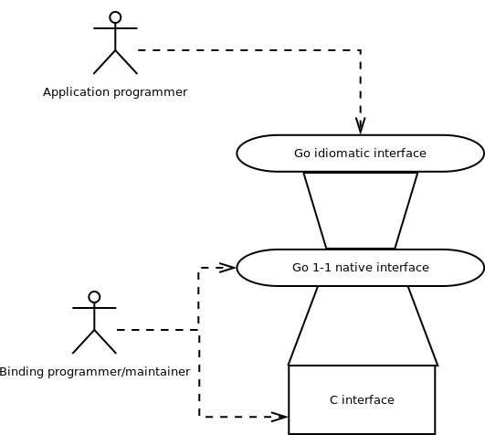

Bitprim's Go interface is built on top of Bitprim's C interface, in this fashion:

On top of the raw C interface, a 1-1 binding is made in Go, in order to separate access to the API from its usage; this avoids impedance mismatch by separating the marshalling aspects from the binding language idiosyncrasies. That is, the 1-1 interface takes care of marshalling, without changing the interface. Then, the idiomatic interface uses the higher level language tools and idioms in order to hide the complexity from the application programmer.

It takes another programmer profile in order to tinker with the lower level interfaces or consume them directly, but that is also possible when working with this approach: 3 separate levels of abstraction for accessing the same functionality.

## Basic structure

---

See [the source in Github](https://github.com/bitprim/bitprim-go/tree/master/bitprim):

* {entity}\_native.go: All of these together implement the 1-1 native interface. As usual, executor is the main entity which is used for manipulating the node.
* {entity}.go: Together, all of these comprise the idiomatic interface. They define user defined types using the Go conventions that Go application programmers are familiar with and expect from a Go library/binding.

## RESTful interface

---

One characteristic that sets Go apart from, say, Python, is the ease with which a REST API can be created and tested from scratch. This is a very useful feature in today's web-centric world, and in order to make things even easier for Go developers, a REST api is also offered in this interface. See [here](https://github.com/bitprim/bitprim-go/tree/master/rest-api) for an example of how to start an http server which hosts it and can be consumed from Postman, Curl or a browser and thus easily integrated into any web application.

