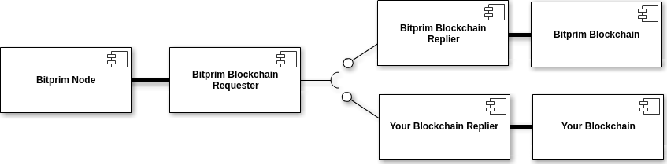
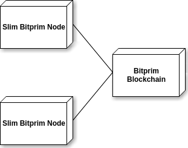
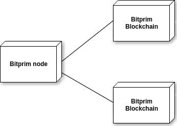

Bitprim has a modular implementation, each piece of the software carries a single function. Also we've implemented a messaging service for the communication beetween some of our modules. Both of this things, allows us to completly replace some pieces of the software with different implementations.

This gives malleability to our software, allowing us to setup different configurations to provide solutions to different problems that may come.  

For example, you can setup two Slim nodes who share a Bitprim Blockchain to minimize the disk space required to run    the nodes. 

If you also need to optimize at maximum the response time of the blockchain modules, you could duplicate them, to balance the charge and improve performance.

