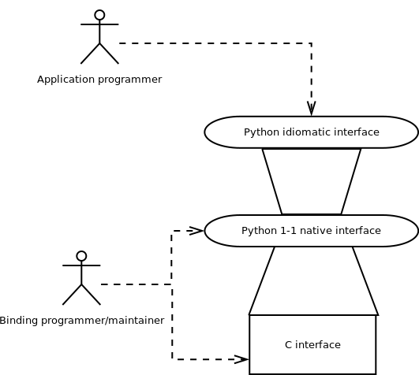

Bitprim's Pyhton interface is built on top of Bitprim's C interface, in this fashion:

On top of the raw C interface, a 1-1 binding is made in Python, in order to separate access to the API from its usage; this avoids impedance mismatch by separating the marshalling aspects from the binding language idiosyncrasies. That is, the 1-1 interface takes care of marshalling, without changing the interface. Then, the idiomatic interface uses the higher level language tools and idioms in order to hide the complexity from the application programmer.

It takes another programmer profile in order to tinker with the lower level interfaces or consume them directly, but that is also possible when working with this approach: 3 separate levels of abstraction for accessing the same functionality.

## Basic structure

---

See [the source in Github](https://github.com/bitprim/bitprim-py/tree/master):

* **bitprimmodule.c**: This is where the 1-1 native interface is implemented. C functions which can be called from Python are defined here, implementing all necessary marshalling.
* **bitprim.py**: This is the idiomatic interface definition. Here, Python classes are defined and Python idioms and conventions offered to make life easier for the Python application programmer.
* **bitprim\_run.py**. Entry point. Creates an executor and starts it. Use for testing the API.

## User guide

---

Python interface documentation is available [here.](https://github.com/bitprim/bitprim-py/blob/master/doc/README.md)
