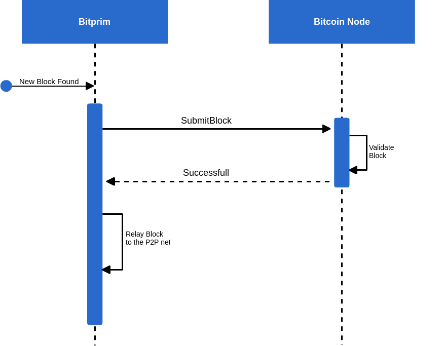

# Real Consensus Layer

Real Consensus allows you to submit blocks trough several bitcoin clients \(we will call them real consensus clients\), and only if the operation is successful the block will be relayed to the p2p network.  This is helpful in cases where there is a restriction on which nodes can submit blocks to the network, but you still want to mine using Bitprim.



To enable Real consensus you need to have another bitcoin client running on par with the Bitprim node. On both clients configure the rpc comunication arguments to interact with each other.

## Configuration

Setup the RPC communication on your real consensus client, by defining username, password, ip and port. Note that since Bitprim uses the default port for RPC communication, you need to change the Real Consensus RPC port so they don't overlap.  


On your Bitprim node [configuration file](https://github.com/bitprim/bitprim-build#configuration-files) add the following lines under the mining section, using the username, password, ip and port you defined on the real consensus client. 

```
real_consensus_enabled = true
real_consensus_endpoint = localhost:19332
real_consensus_user = user
real_consensus_pass = pass
```


