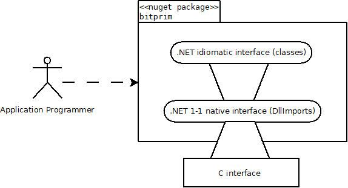

Bitprim's .NET interface is built on top of Bitprim's C interface, in this fashion:

On top of the raw C interface, a 1-1 binding is made in .NET, by using the [Platform Invoke mechanism](https://msdn.microsoft.com/en-us/library/55d3thsc.aspx?f=255&MSPPError=-2147217396), in order to separate access to the API from its usage; this avoids impedance mismatch by separating the marshalling aspects from the binding language idiosyncrasies. That is, the 1-1 interface takes care of marshalling, without changing the interface. Then, the idiomatic interface uses the higher level language tools and idioms in order to hide the complexity from the application programmer.

It takes another programmer profile in order to tinker with the lower level interfaces or consume them directly, but that is also possible when working with this approach: 3 separate levels of abstraction for accessing the same functionality.

The platform invoke mechanism was chosen in order  to support as many operating systems as possible, because .NET Core does not support C++/CLI.

## Basic structure

---

See [the source in Github](https://github.com/bitprim/bitprim-cs/tree/master):

* **idiomatic classes**: Object oriented abstractions over Bitcoin concepts: Chain, Transaction, Block, Header, and so on. The Executor class is responsible for handling node execution.
* **native classes**: These are all static classes, since each of these contains a set of DllImports of the native C functions.

