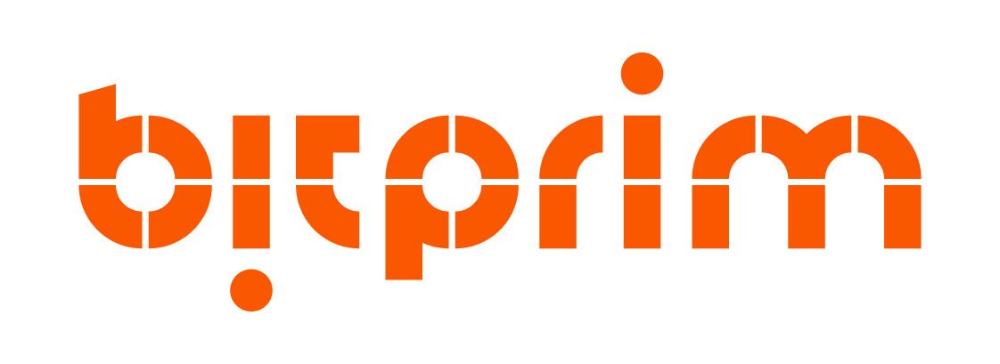

##### 

##### "Bringing Bitcoin Cash to everyday life"

##### 

## Welcome to Bitprim

Bitprim is a multi-coin developing platform, working with multi-languages programming compatible with the Satoshi Client.

Download:

* Github: [https://github.com/bitprim](https://github.com/bitprim)
* Slack: bitprim.slack.com 
* Email: info@bitprim.org

The platform includes:

* 100% Satoshi Client Compatible Protocol Implementation
* Mining Engine
* Multi-Coin
    * Bitcoin Cash (BCH)
    * Bitcoin (BTC)
    * Litecoin (LTC)
* RPC support
* C Interface
* C++ Interface
* Interfaces for Go, Python, Node, C\# and others